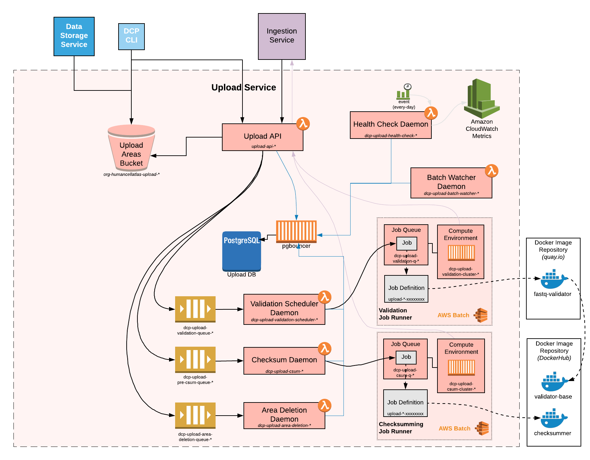

# Data Coordination Platform, Upload Service

[](https://travis-ci.org/HumanCellAtlas/upload-service)
[](https://codeclimate.com/github/HumanCellAtlas/upload-service/maintainability)
[](https://codeclimate.com/github/HumanCellAtlas/upload-service/test_coverage)
[](https://app.zenhub.com/workspace/o/humancellatlas/upload-service/boards?repos=96461745)

## Overview

The DCP Upload Service provides a file staging and validation facility for the DCP.
Upload Areas are created/deleted using a REST API, which is secured so only the DCP Ingestion Service may use it.
Files are staged into AWS S3 using the HCA CLI, where the Upload Service then computes checksums for them.
The validation service runs Docker images against files.


## Components

### upload-api

Is a Lambda Chalice/Connexion/Flask app that presents the Upload Service REST API.
The API is defined using an OpenAPI 2.0 Specification (Swagger) in `config/upload-api.yml`.

### upload-queue

A SQS that receives messages on S3 ObjectCreated events and then triggers the upload checksum lambda function

### upload-checksum-daemon

Is a lambda function triggered by SQS events that computes checksums for uploaded files.

### Validation Batch Service

Is an AWS Batch installation


## System Architecture Diagram


Image by [Sam Pierson](mailto:spierson@chanzuckerberg.com)

## Development Environment Setup

### Prerequisites

 - A Linux/Unix machine
 - git
 - Python 3.7

Check out the upload service repo:

```bash
# IMPORTANT use --recursive
git clone --recursive git@github.com:HumanCellAtlas/upload-service.git
cd upload-service
```

Install packages.  I use `virtualenv`, but you don’t have to.  This is what it looks for me:

```bash
mkdir venv  # I have venv/ in my global .gitignore
virtualenv --python python3.7 venv/37
source venv/37/bin/activate
pip install -r requirements-dev.txt
```

Do this once:

```bash
cp config/environment.dev.example config/environment.dev
```
Then edit as necessary.

## Running Tests

```bash
export AWS_PROFILE=hca
source config/environment
make test
```
### Running Tests Offline
Tests may also be run offline if you have a PostgreSQL server running locally.
You must setup an `upload_local` postgres database first, e.g.:

```bash
brew install postgres
# follow instructions to start postgres server
createuser
createdb upload_local
DEPLOYMENT_STAGE=local make db/migrate
```
To run tests offline use the `local` environment:
```bash
export DEPLOYMENT_STAGE=local
source config/environment
make test
```

### Running Locally
```bash
source config/environment
scripts/upload-api
```

## Running Functional Tests
```bash
export DEPLOYMENT_STAGE=dev
source config/environment
make functional-tests 
```


## Deployment/Release Process

Deployment is typically performed by Gitlab. The full instructions on how to deploy to each environment (i.e. 
integration, prod, etc.) can be found [here](
https://allspark.dev.data.humancellatlas.org/HumanCellAtlas/upload-service/wikis/How-to-Deploy-the-Upload-Service).

To manually deploy to e.g. the staging deployment:

```bash
export enc_password="<password-used-to-encrypt-deployment-secrets>"
scripts/deploy.sh staging
```


## Validation Deployment

*UNDER CONSTRUCTION - NOTHING TO SEE HERE*

### Prerequisites

 * Create the validation AMI before deploying creating the Batch installation.
   See instructions in `validation/ami/README.md`.
 * Your VPC must have security groups named `default` and `inbound-ssh-from-hca-teams`.
 * Create IAM policy `upload-validator-<stage>` and role `upload-validator-<stage>`.
 * Have Docker installed and running on your local machine.

### Do It

```bash
scripts/batchctl.py staging setup

cd validation/docker-images/base-alpine-python36
make release
```
